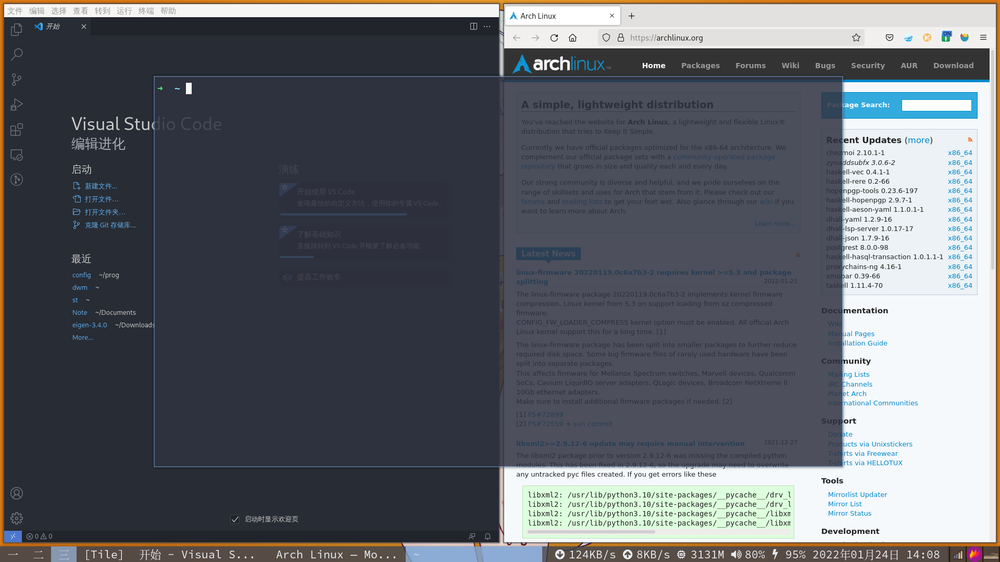

**refer to github{@theniceboy, @WindyValley}**

---
预览效果如下:

改动大致如下：
- 字体：SauceCodePro Nerd Font(英文字体)，Noto Serif CJK SC(中文字体)
  
- 状态栏调制底部，Tag换成简写中文数字“一”到“九”

- 修改Makefile，添加config.def.h为文件config.h的构建依赖，安装命令添加将autostart脚本复制到~/.local/share/dwm的步骤，使得安装与修改更加便捷

- 补丁列表：
    - alphasystray：提供状态栏透明效果和一个简单的系统托盘，为解决alpha补丁与systray补丁不兼容而诞生
    - autostart：能够依此从"$XDG_DATA_HOME/dwm", "$HOME/.local/share/dwm", 和 "$HOME/.dwm"文件夹中寻找可执行的autostart.sh文件，在dwm启动后执行
    - awesomebar：使标题栏显示多窗口标题而非当前窗口的标题；当点击标题栏时，对应窗口会隐藏
    - hide_vacant_tags：当标签内没有窗口时，将会隐藏标签；如果所有标签内都没有窗口，则会保留一号标签
    - rotatestack：可轮流切换窗口位当前标签内的主窗口
    - uselessgap: 在每个window之间增加空隙，提升视觉效果
    - scratchpad: 一个小的终端窗口
    - fullscreen: 使window全屏

自启动脚本以及补丁alphasystray来自于theniceboy。并对其进行较多修改以符合自己的体验。
所有使用的补丁放置于patches文件夹内，如有需要，请自行取用。

============================

以下是suckless撰写的dwm自述文件：

dwm - dynamic window manager
============================
dwm is an extremely fast, small, and dynamic window manager for X.

Requirements
------------
In order to build dwm you need the Xlib header files.

Installation
------------
Edit config.mk to match your local setup (dwm is installed into
the /usr/local namespace by default).

Afterwards enter the following command to build and install dwm (if
necessary as root):

    make clean install

Running dwm
-----------
Add the following line to your .xinitrc to start dwm using startx:

    exec dwm

In order to connect dwm to a specific display, make sure that
the DISPLAY environment variable is set correctly, e.g.:

    DISPLAY=foo.bar:1 exec dwm

(This will start dwm on display :1 of the host foo.bar.)

In order to display status info in the bar, you can do something
like this in your .xinitrc:

    while xsetroot -name "`date` `uptime | sed 's/.*,//'`"
    do
    	sleep 1
    done &
    exec dwm

Configuration
-------------
The configuration of dwm is done by creating a custom config.h
and (re)compiling the source code.